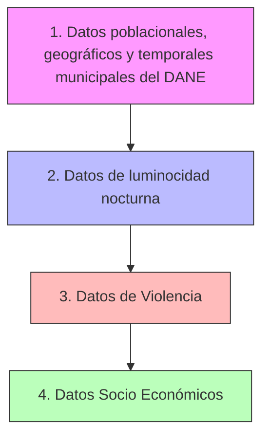

# Methodology

## Overview

This project aims to forecast atypical violence and support the *Early Warning System (Sistema de Alertas Tempranas)* of the *Colombian Ombudsman’s Office (Defensoría del Pueblo)*. The project focuses on developing a methodology for feature engineering and machine learning models to predict violence surges.

The statistical approach follows these steps:
1. The violence index, called **IACV**, is a weighted sum of homicides, terrorism, extortion, kidnapping, and massacres per 100,000 inhabitants per municipality.  
2. The weights are determined by the *average years of prison sentence* for each type of crime.  
3. A violence surge, or atypical violence event, is defined as a level of the violence index in a given quarter that exceeds one standard deviation above the mean of the previous four quarters for that municipality.  
4. The task is formulated as a classification problem.  
5. The dataset consists of quarterly municipality-level data covering at least ten years for all municipalities in Colombia.  
6. The models to be tested include regular time series models, Elastic Net, Random Forest, XGBoost, and LSTM.  
7. Lagged variables of this and other violence indices will be included as predictors.  

## Data Collection

### Data Sources
### Violencia
1. Homicidio, Extorsión, Secuestro y Terrorismo
1.1. Ministerio de Defensa y Fiscalía
2. Masacres
2.1. [Datos Abiertos](https://www.datos.gov.co/dataset/MASACRES/u8eq-92tb/about_data), Ministerio de Defensa, [Rutas del Conflicto](https://rutasdelconflicto.com/masacres), Fiscalía e [Indepaz](https://indepaz.org.co/informe-de-masacres-en-colombia-durante-el-2020-2021/comment-page-4/?utm_source=chatgpt.com)
2.1.1 Hay que unir varias fuentes de datos. Hay que dedicarle su tiempo. ¿Se tienen que medir por número de masacres o víctimas?¿Cómo cambia su tasa por 100mil hab.? ¿Cómo lo trata [este man](https://repositorio.uniandes.edu.co/entities/publication/6a5d9e48-9615-40cc-bccc-7121585edb68)?
3. Luces nocturnas
3.1. VIIRS-DNB 
    <details>
        - Cuenta activa en GEE: https://code.earthengine.google.com
        - Shapefile/GeoJSON de municipios DIVIPOLA con campos `cod_mpio` y `nom_mpio`.
        - CRS del archivo: EPSG:4326. Geometrías válidas (sin self-intersections).

        ###### 1) Subir los municipios a GEE como Asset
        1. En el Code Editor: panel izquierdo → **Assets** → **NEW** → **Shape/CSV/JSON**.
        2. Carga el `.zip` del shapefile o el `.geojson`.
        3. Asigna un nombre de Asset, por ejemplo: `users/tu_usuario/col_mpios`.
        4.1. Verifica que los atributos incluyan `cod_mpio` y `nom_mpio`.

        ###### 2) Abrir un script nuevo y pegar el código
        - En el Code Editor: **Scripts** → **New** → pega el siguiente código (JavaScript).
        - Ajusta `inicio`, `fin` y la ruta de tu Asset municipal.
        ```
            // === Parámetros de usuario ===
            var inicio = '2016-01-01';
            var fin    = '2025-10-31';
            var mpios  = ee.FeatureCollection('users/tu_usuario/col_mpios'); // <-- cambia a tu asset

            // === Colección VIIRS mensual V1 (VCMSLCFG) ===
            // Bandas principales: avg_rad (nW/cm2/sr), cf_cvg (0-100, cobertura válida)
            var viirs = ee.ImageCollection('NOAA/VIIRS/DNB/MONTHLY_V1/VCMSLCFG')
            .filterDate(inicio, fin);

            // === Generar lista de meses en el rango ===
            var nMeses = ee.Date(fin).difference(ee.Date(inicio), 'month');
            var meses = ee.List.sequence(0, nMeses.subtract(1));

            // === Función por mes: tomar imagen, enmascarar por cobertura y reducir por municipio ===
            var perMes = meses.map(function(m){
            var start = ee.Date(inicio).advance(m, 'month');
            var end   = start.advance(1, 'month');

            var img = viirs.filterDate(start, end).first();
            // Seguridad: si no hay imagen ese mes, devolver colección vacía
            return ee.Algorithms.If(img,
                ee.Image(img).expression('rad', {'rad': ee.Image(img).select('avg_rad')})
                .updateMask(ee.Image(img).select('cf_cvg').gt(0)) // usar píxeles con cobertura válida
                .rename('mean_target')
                .reduceRegions({
                    collection: mpios,
                    reducer: ee.Reducer.mean().setOutputs(['mean_rad']),
                    scale: 500,       // resolución nominal ~500 m
                    crs: 'EPSG:4326'
                })
                .map(function(f){
                    return f.set({
                    year:  start.get('year'),
                    month: start.get('month'),
                    ym:    start.format('YYYY-MM')
                    });
                }),
                ee.FeatureCollection([]) // sin datos ese mes
            );
            });

            // === Aplanar resultados y seleccionar columnas finales ===
            var tabla = ee.FeatureCollection(perMes).flatten()
            .select(['cod_mpio','nom_mpio','year','month','ym','mean_rad']);

            // Vista rápida en consola
            print('Vista ejemplo', tabla.limit(5));

            // === Exportar a Google Drive en CSV ===
            Export.table.toDrive({
            collection: tabla,
            description: 'viirs_mensual_municipios_COL_2016_2025',
            fileFormat: 'CSV'
            });
        ```
        ###### 3) Ejecutar
        - Clic en **Run**.
        - En el panel **Tasks** aparecerá el trabajo **Export.table.toDrive**.
        - Clic en **Run** dentro de Tasks, confirma parámetros y espera a que termine.

        ###### 4) Descargar el CSV
        - Ve a tu Google Drive → carpeta raíz (o la que elegiste) → descarga `viirs_mensual_municipios_COL_2016_2025.csv`.

        ###### 5) Estructura del CSV resultante
        - Columnas: `cod_mpio, nom_mpio, year, month, ym, mean_rad`.
        - `mean_rad`: radiancia media mensual por municipio, en nW/cm²/sr.
        - Una fila por municipio y por mes disponible dentro del rango.

        ###### 6) Validación rápida
        - En la consola del Code Editor revisa `tabla.limit(5)` para ver campos.
        - Conteo esperado ≈ (# municipios) × (# meses con imagen).
        - Si faltan meses, revisa el rango y disponibilidad del dataset.

        ###### 7) Personalizaciones útiles
        - Mediana en vez de media:
            // reemplaza el reducer por:
            // reducer: ee.Reducer.median().setOutputs(['median_rad'])
        - Más estadísticas juntas:
            // ee.Reducer.mean().combine(ee.Reducer.median(), '', true)
            //       .combine(ee.Reducer.stdDev(), '', true)
        - Filtrado geográfico:
            // si tienes una región de interés, usa mpios.filter(ee.Filter.inList('cod_mpio', ['XXXX','YYYY']))
        - Cambio de período:
            // solo ajusta 'inicio' y 'fin'; desde 2014-01 suele haber datos mensuales.

        ###### 8) Errores comunes y soluciones
        - **Asset no encontrado**: confirmas la ruta exacta `users/tu_usuario/col_mpios`.
        - **Campos faltantes**: garantiza `cod_mpio` y `nom_mpio` en atributos del shapefile.
        - **CRS inconsistente**: sube el shapefile en EPSG:4326; GEE reproyecta, pero es más estable.
        - **Valores nulos**: ocurren donde `cf_cvg == 0`. El script ya enmascara con `cf_cvg > 0`.
        - **Export atascado**: divide el rango por años (exportos por bloques) si tu lista de municipios es muy grande.

        ###### 9) Reproducibilidad
        - Guarda el script con nombre claro y fija `inicio` y `fin` con fechas ISO.
        - Anota el ID exacto del dataset: `NOAA/VIIRS/DNB/MONTHLY_V1/VCMSLCFG`.
    </details>
4. Variables Sociales.
4.1 Panel del CEDE
    <details>
        4.1.1. Socioeconómicos
            •	Desempleo y subempleo.
            •	Pobreza multidimensional y desigualdad (Gini).
            •	PIB per cápita municipal o regional.
            •	Brechas urbano–rurales.
            •	Precios agrícolas y choques de ingresos rurales.
        4.1.2. Institucionales y de seguridad
            •	Presencia de Fuerza Pública (pie de fuerza, estaciones, gasto en seguridad).
            •	Judicialización efectiva (tasa de esclarecimiento).
            •	Corrupción o captura institucional local.
            •	Existencia de programas de sustitución o reintegración.
        4.1.3. Demográficos y migratorios
            •	Estructura etaria (jóvenes 15–29 años).
            •	Crecimiento poblacional.
            •	Migración interna y desplazamiento forzado.
            •	Densidad poblacional y urbanización.
        4.1.4. Territoriales y geográficos
            •	Accesibilidad vial y tiempo a capital departamental.
            •	Presencia de economías ilícitas (cultivos de coca, minería ilegal).
            •	Fronteras, corredores estratégicos, rutas de tráfico.
            •	Tenencia de la tierra y conflictos agrarios.
        4.1.5. Sociales y de conflicto armado
            •	Actividad de grupos armados ilegales.
            •	Enfrentamientos y eventos de violencia política.
            •	Tasa de homicidios y masacres previas (memoria del conflicto).
            •	Participación electoral y polarización política.
        5.
        | Tipo de variable | Variable | Medida temporal más desagregada | Fuente |
        |------------------|-----------|----------------------------------|---------|
        | **Violencia y conflicto** | Homicidios | Mensual / Evento | INMLCF (Presuntos homicidios) |
        | | Delitos varios (hurto, lesiones, amenazas) | Mensual | Policía Nacional (Estadística delictiva) |
        | | Masacres | Evento | Indepaz |
        | | Enfrentamientos, protestas, explosivos | Semanal / Evento | ACLED |
        | | Desplazamiento forzado | Mensual / Evento | Unidad para las Víctimas (SIEVCAC) |
        | **Economías ilícitas** | Cultivos de coca (ha) | Anual | UNODC-SIMCI |
        | | Explotación de oro de aluvión | Anual | UNODC (EVOA) |
        | **Demografía y migración** | Población total y por edad | Anual | DANE (Proyecciones municipales) |
        | | Migración internacional y venezolana | Mensual–Trimestral | Migración Colombia, ACNUR–R4V |
        | **Socioeconómicas** | Pobreza monetaria | Anual | DANE (SAE) |
        | | Pobreza multidimensional | Anual | DANE (IPM municipal, PDET) |
        | | PIB per cápita | Departamental anual (proxy municipal posible) | DANE |
        | **Institucionales y justicia** | Pie de fuerza/presencia policial | Estructural | Policía Nacional / MinDefensa |
        | | Tasa de esclarecimiento judicial | Anual | Fiscalía General de la Nación |
        | | Índices de transparencia y corrupción local | Anual | Transparencia por Colombia / Procuraduría |
        | **Territoriales y accesibilidad** | Tiempo de viaje a capital | Estudio puntual / estructural | DNP (Matrices de accesibilidad) |
        | | Red vial / distancia | Estática (actualizable) | IGAC, Colombia en Mapas |
        | **Tierras y conflicto agrario** | Restitución de tierras | Anual / evento | URT (Datos Abiertos) |
        | | Catastro multipropósito / tenencia | Estructural / actualización periódica | IGAC |


        Se puede crear una variable que indique qué partido ganó la alcaldía municipal en los municipios de Colombia en los últimos años.

        Qué necesitas
            1.	Un listado de todos los municipios de Colombia.
            2.	Para cada elección municipal (por ejemplo, cada 4 años: 2015-2019, 2019-2023, etc) el partido político o alianza que ganó la alcaldía en cada municipio.
            •	Puedes descargar datos de Registraduría Nacional del Estado Civil → “Histórico de resultados electorales”.  
            3.	Crear la variable, por ejemplo:
            ````
                Municipio, Año, PartidoGanador
                “Medellín”, 2019, “Partido X”
                “Medellín”, 2023, “Partido Y”
                … 
            ```
            	4.	Normalizar los nombres de partidos/alianzas para permitir análisis comparativos (ya que alianzas cambian nombres, partidos nuevos, etc).
                5.	(Opcional) Unir esta variable a otros datos municipales (población, indicadores socio-económicos, etc.) para análisis comparativo.

                Consideraciones
                    •	Las elecciones de alcaldes municipales en Colombia se hacen cada cuatro años.  
                    •	Los datos de cada municipio podrían requerir limpieza: alianzas locales, nombres de agrupaciones no estandarizadas.
                    •	Puede haber municipio con elección atípica o cambio fuera del ciclo regular (vacancia, sustitución) que compliquen uniformidad.
                    •	Dependiendo del análisis, definirás si la variable toma valores nominales (nombre del partido) o categóricos (“partido tradicional”, “nuevo partido”, “coalición”, etc).

    <\details>

### Data Acquisition Process

### Data Quality Assessment
#### Cosas a tener en cuenta:
1. Los datos de violencia solo tienen valores cuando ocurre un hecho, por lo que es necesario basarse en una tabla de tiempo que incluya trimestres y años para poder inputar los campos que no tienen valor.
2. Hay que inputar los valores de poblacion de manera que tengamos valore reales al final del año pero en la mitad se imputen con el promedio o algo
3. Qué tan supuesto duro sería imputar indices de pobreza anualmente a la misma tasa que auemnta las luces nocturnas
4. Hay que tener en cuenta la correlación geografica.

## Data Preprocessing

### Data Cleaning

### Missing Data Handling

### Feature Engineering

### Data Transformation

## Exploratory Data Analysis

### Descriptive Statistics

### Correlation Analysis

### Visualization

## Statistical Analysis

### Hypothesis Testing

### Regression Analysis

### Time Series Analysis

## Econometric Methods

### Model Specification

### Estimation Techniques

### Diagnostic Tests

### Robustness Checks

## Machine Learning Approaches

### Feature Selection

### Model Selection

### Cross-Validation Strategy

### Hyperparameter Tuning

### Algorithms Used

## Deep Learning Methods

### Architecture Design

### Training Strategy

### Regularization Techniques

### Performance Optimization

## Model Evaluation

### Evaluation Metrics

### Validation Strategy

### Comparison Framework

## Results Interpretation

### Statistical Significance

### Economic Significance

### Model Limitations

## Conclusion

### Key Findings

### Implications

### Future Research Directions
